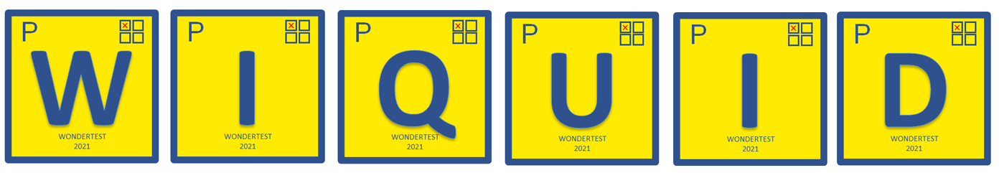

<p align="center"><a href="https://wiquid.fr" target="_blank"></a></p>

<p align="center"><a href="https://wiquid.fr/projects/w2qti" target="_blank"></a></p>


## About W2QTI
Increase your workflow by importing your questions from your Word document to TAO.

The most frequent interaction used in digital assessment is Choice. Many QTI users asked me to find a way to quickly import their long word documents filled with choice questions. Here is a solution.

W2QTI is a web application that converts your multi-choice or single-choice questions from word to the QTI format. What is the QTI format ? It is an XML standard defined by <a  target="_blank" href="https://www.imsglobal.org/question/qtiv2p2/imsqti_v2p2_impl.html">IMS Global</a> that is compatible with many assessment platforms like <a target="_blank" href="www.taotesting.com">TAO</a> for example.

You can easely import to your assessment platform not only your items' content but also their correction and soon many other options and CSS choices.

Simply upload your Word document and the converter handles the rest. Download the [Word template (cmod.docx)](cmod.docx) to get started quickly.

This converter does not save any data about your item on the server. No cookies and no information are stored.

---

## Word Document Format

Two modes are available. The **Upload mode** (recommended) requires no copy-paste and no special syntax.

### Upload Mode (recommended)

Structure your Word document using native Word formatting:

| Element | Word formatting |
|---|---|
| Question | **Numbered list** (Home → "List Number" style) |
| Answer | **Bulleted list** (Home → "List Bullet" style), indented under the question |
| Correct answer | **Bold** the answer text |
| Multiple correct answers | Bold several answers |

No asterisks, no empty lines, no manual numbering — Word handles all of that.

**Example (as seen in Word):**

```
1. Which of the following is the capital of France?
   • London
   • Paris          ← bold in Word
   • Berlin
   • Madrid

2. What is the chemical symbol for water?
   • CO2
   • H2O            ← bold in Word
   • NaCl
```

Download [cmod.docx](cmod.docx) for a ready-to-use template.

---

### Manual Mode (plain text fallback)

If you prefer to paste plain text, switch to **Manual mode** in the app and follow these rules:

| Element | Format |
|---|---|
| Question | `number` + `.` + `space` + question text |
| Answer | `letter` + `.` + `space` + answer text |
| Correct answer | `*` at the very end of the answer (no trailing space!) |
| Separator between questions | one empty line |
| End of document | exactly one empty line |

> **Warning:** a space after the `*` will break the parser — the asterisk must be the very last character of the line.

```
1. Which of the following is the capital of France?
a. London
b. Berlin
c. Paris*
d. Madrid

2. What is the chemical symbol for water?
a. CO2
b. H2O*
c. NaCl

```

---

## Local Installation

### Prerequisites

- [Docker](https://docs.docker.com/get-docker/) and [Docker Compose](https://docs.docker.com/compose/install/)
- Git

No PHP, Composer, or Node.js installation required on the host machine.

### Setup

**1. Clone the repository**

```bash
git clone <repository-url>
cd W2QTI_choiceInteraction
```

**2. Install PHP dependencies**

Use a temporary Docker container to install Composer packages (no local PHP needed):

```bash
docker run --rm -u "$(id -u):$(id -g)" \
  -v "$(pwd):/var/www/html" \
  -w /var/www/html \
  laravelsail/php81-composer:latest \
  composer install --ignore-platform-reqs
```

**3. Create the environment file**

```bash
cp .env.example .env
```

Edit `.env` and set `DB_CONNECTION=sqlite` (the app does not use a database, but Laravel requires a valid driver):

```
DB_CONNECTION=sqlite
```

**4. Generate the application key**

```bash
docker run --rm -v "$(pwd):/var/www/html" w2qti-app php artisan key:generate
```

> Note: run this after the first `docker compose build` step below, or use the pre-built image tag.

### Running the App

**Build the Docker image:**

```bash
docker compose build
```

**Start the container:**

```bash
docker compose up -d
```

**Generate the app key** (first run only):

```bash
docker exec w2qti_choiceinteraction-app-1 php artisan key:generate
```

**Fix storage permissions** (first run only, or after a fresh clone):

```bash
docker exec -u root w2qti_choiceinteraction-app-1 \
  chmod -R 777 storage bootstrap/cache
```

**Open the app in your browser:**

```
http://localhost:8080
```

### Useful Commands

| Action | Command |
|---|---|
| Start | `docker compose up -d` |
| Stop | `docker compose down` |
| View logs | `docker logs w2qti_choiceinteraction-app-1` |
| Open a shell | `docker exec -it w2qti_choiceinteraction-app-1 bash` |
| Rebuild image | `docker compose build --no-cache` |
